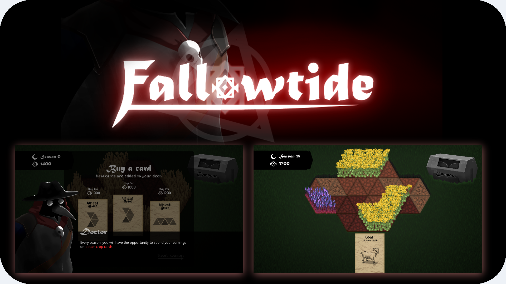

# Fallowtide
This is the Github repository for Fallowtide, a Ludum Dare 52 game!

## Play the game

### Windows
You can download the game for free from [my Itch.io](https://plasmastarfish.itch.io/fallowtide).

### Linux
There is no native Linux build, but you can run the game from source with Python 3.7 or higher.

If running on Ubuntu or similar:
- Install Python 3.X: `$ sudo apt-get install python3`
- Install Pip: `$ sudo apt-get install python3-pip`
- Install PyGame: `$ pip3 install pygame`
- Navigate to the repository folder and run the game: `$ python3 game.py`

## About

This game, including all graphics, audio, and programming, was done by me in 48 hours for [Ludum Dare 52](https://ldjam.com/events/ludum-dare/52).

I used the following tools:

- **Art:** Paint.NET
- **Audio:** SFXR, Audacity, my Casio keyboard
- **Code:** Python/PyGame
- **Fonts:** Alef, Alagard, Matura, Segoe UI

## License

### Source code
The source code for this game is released under the included MIT License. This essentially means you can borrow, reuse, or modify the code for your own projects, commercial or personal, as long as you include the license and copyright notice.

### Art and sound assets
All rights reserved.
